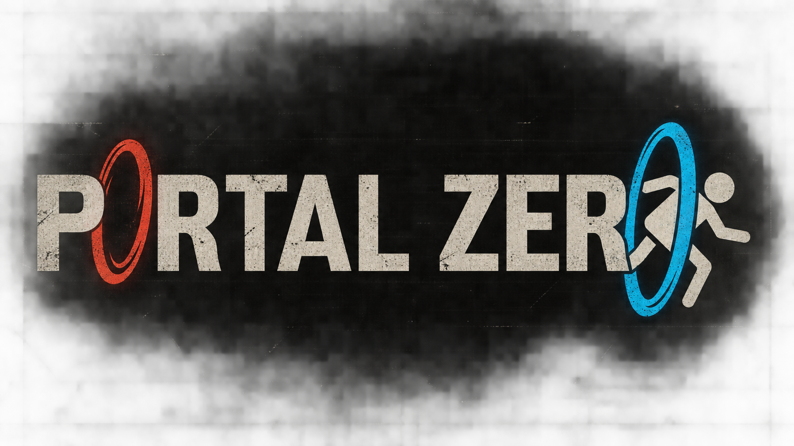
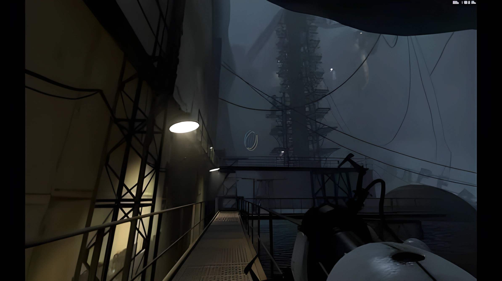

# Portal-zero

## A three.js build of a precursor to portal and portal 2
## Takes place in the old apertue science lab

### this project is NOT DONE - i am working on it
### feel free to fork it and deploy on GitHub pages, but i have my link is here (reccommend using it): https://nsvene32-prog.github.io/Portal-zero/

